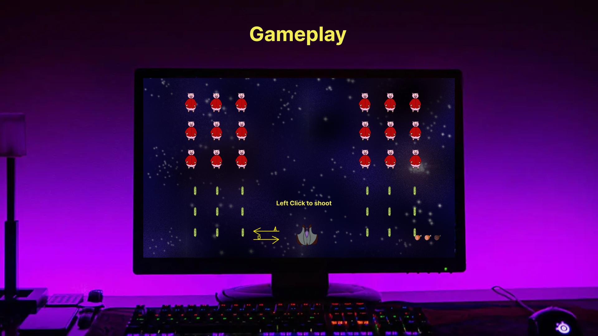
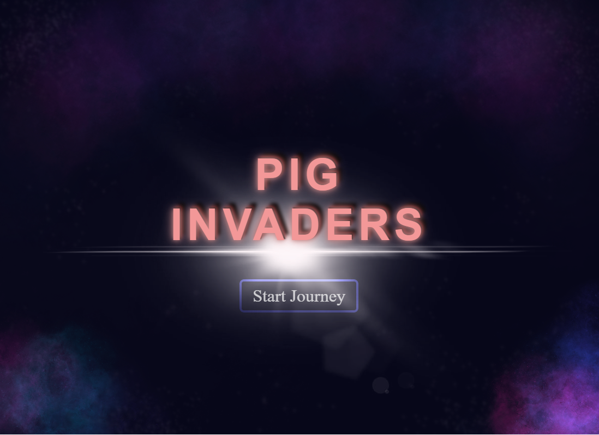
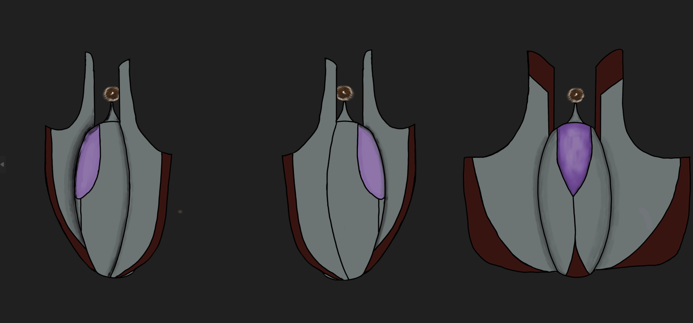
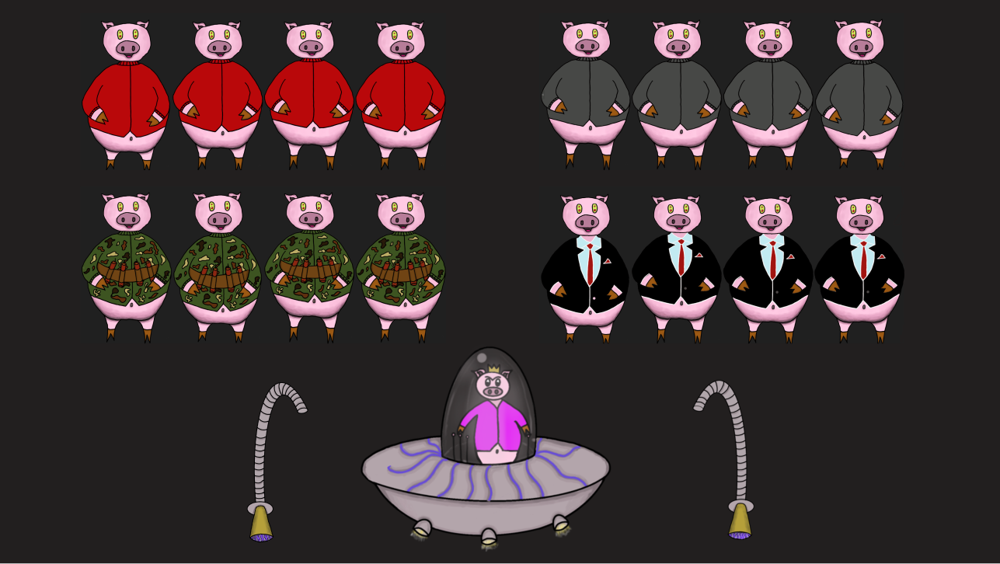

# 🎮 **Pig Invaders** 

> "Defend the galaxy from an oinking invasion in Pig Invaders! This fast-paced arcade shooter puts you in the cockpit as you battle waves of spacefaring pigs and dodge raining projectiles. Can you save the universe from total Pig domination?"

---

## 🌐 **Play Pig Invaders now**
[Click here to play the game!](https://your-github-username.github.io/repository-name)

---

## 📸 **About the Game**

### Main Gameplay:

  
  
*Figure 1: Example of gameplay in action.*

---

### Menu:

  
  
*Figure 2: Menu and user interface.*

---

## 🎨 **Spritesheets**
Below are the sprites used to create characters and objects in the game:

### Player Character:

  
  
*Figure 3: Player character animations.*

---

### Enemies:

  
  
*Figure 4: Enemy animations.*

---

## ✍️ **Reflection**

### What went well:
- **Creative Design:** The theme and style came together seamlessly, and the sprites were fun to design.
- **Core Mechanics:** The gravity-based gameplay worked better than expected and provided a unique challenge.

### Challenges:
- **Time Constraints:** Implementing all the features we envisioned wasn’t possible due to the limited timeframe.
- **Bug Fixes:** Handling collisions and edge cases for gravity mechanics was tricky.

### Lessons Learned:
- **Prototyping Matters:** Testing early prototypes helped refine the core mechanics quickly.
- **Keep it Simple:** Focusing on one unique mechanic instead of multiple features made the game more polished.
